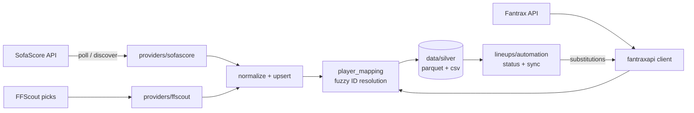

# FantraxAPI — lineup ingestion pipeline & Fantrax client

A Python backend / data-engineering project built around fantasy football (Premier League) on [Fantrax](https://www.fantrax.com).
It ingests match-day lineups from SofaScore, reconciles player identities across three data sources, and uses the result to drive
automated roster actions on Fantrax.

> Forked from [meisnate12/FantraxAPI](https://github.com/meisnate12/FantraxAPI) (MIT). The upstream project provides the base
> Fantrax HTTP client; the lineup pipeline, player-identity resolution, roster automation CLIs and apps are original additions in this fork.

## What it demonstrates

- **Ingestion** – async SofaScore polling (`httpx`, `tenacity` retries) with a kickoff-relative polling window, plus a scraper for FFScout predicted picks.
- **Entity resolution** – fuzzy cross-source player matching (Fantrax ↔ SofaScore ↔ FFScout) using `rapidfuzz` and accent-folding, with a YAML-backed mapping store and unmatched-player reports.
- **Modelling & validation** – `pydantic` models for lineups and a status state machine (preliminary → pending confirmation → confirmed → final).
- **Storage layout** – raw JSON landed per event, normalized tables written as Parquet/CSV (`data/silver`), idempotent upserts keyed by event.
- **Automation** – lineup sync that compares confirmed starters to a Fantrax roster and submits substitutions; FAAB/trade monitors; waiver and drop helpers.
- **Tooling** – `pyproject.toml` packaging, ruff, pytest with offline/live test split, GitHub Actions CI, Streamlit front-ends.

## Architecture



## Repository layout

| Path | Purpose |
|---|---|
| `fantraxapi/` | Installable library: Fantrax client, `providers/` (SofaScore, FFScout), `lineups/` (models, status, automation), `player_mapping` |
| `pipelines/` | Batch ETL entry points: schedule/lineup export, player-mapping builders |
| `cli/` | User-facing commands: substitutions, drops, claims, roster listing, FAAB/trade monitors, lineup optimizer, cookie setup |
| `apps/` | Runnable apps: `lineup_watcher` (poll + act), `roster_viewer` and `auth_login` (Streamlit) |
| `config/` | Team/league mappings and the generated `player_mappings.yaml` |
| `utils/` | Auth and roster helpers shared by the apps |
| `tests/` | pytest suite with mocked Fantrax/SofaScore |
| `docs/` | Sphinx docs for the client (upstream) and `notes/` on auth, substitutions and roadmap |
| `scripts/` | One-off demos and `manual_checks/` (ad-hoc scripts, not part of the test suite) |
| `data/` | Generated outputs — gitignored |

## Quickstart

```bash
python -m venv .venv && source .venv/bin/activate
pip install -e ".[dev,pipelines,apps]"   # extras: scrapers, pipelines, apps
cp config.example.ini config.ini     # fill in your league/team IDs; never commit real values
pytest                                # offline tests only
```

Authenticated actions need a Fantrax session cookie; see [docs/notes/auth.md](docs/notes/auth.md). Cookie files and `config.ini` are gitignored.

```bash
python pipelines/export_schedule_and_lineups.py --tournament-id 17 --upcoming --with-lineups
python pipelines/update_player_mappings.py --noninteractive
python -m apps.lineup_watcher.watch_lineups --window 90 --interval 60
python cli/substitutions.py --league-id <LEAGUE_ID>
```

Tests that hit real endpoints are marked `live` and skipped by default: `pytest -m live` (needs `LEAGUE_ID`).

## Client library

```python
from fantraxapi import FantraxAPI

api = FantraxAPI("<league_id>")           # public data
for _, period in api.scoring_periods().items():
    print(period)
```

Private leagues need a logged-in session passed as `FantraxAPI(league_id, session=session)`; see the upstream
[documentation](https://fantraxapi.metamanager.wiki) for the base client API.

## Status & known gaps

- Eight tests in `tests/lineups`, `tests/providers` and `tests/test_lineup_workflow.py` predate the current `LineupRecord` shape and are marked `xfail` until rewritten.
- `fantraxapi/lineups/sofascore_*` is a legacy copy of `fantraxapi/providers/sofascore`; consolidation is pending.
- `docs/` still carries upstream branding and badges.

## License

MIT — see [LICENSE](LICENSE). Upstream copyright remains with its authors.
